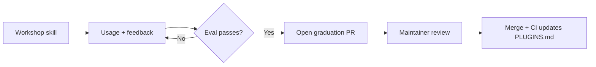
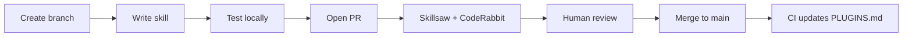

# Contributing to UXD AI Helpers

We welcome contributions of new skills, agents, plugins, and documentation.

Plugins work in **Claude Code** and **Cursor**. Each plugin has identical manifests in `.claude-plugin/` and `.cursor-plugin/` so each tool discovers it natively.

## Choose Your Path

| I want to... | Go here |
|---|---|
| **Contribute a PatternFly skill** (component dev, design tokens, migration, a11y) | [PatternFly contributions](#patternfly-contributions) |
| **Contribute a UXD skill** (internal team tooling) | [UXD contributions](#uxd-contributions) |
| **Report a bug or request a feature** | [Open an issue](../../issues/new/choose) |

### PatternFly contributions

PatternFly skills live under `plugins/patternfly/` and use the `pf-` prefix. You don't need to understand UXD tooling to contribute.

**Quick start:**

1. Fork and clone this repo
2. Create your skill: `make scaffold PLUGIN=pf-react SKILL=pf-my-skill`
3. Edit the generated `SKILL.md` — see [CONTRIBUTING-SKILLS.md](CONTRIBUTING-SKILLS.md) for the full guide
4. Test locally: invoke `/pf-react:pf-my-skill` on a real scenario
5. Run `make validate` to check consistency
6. Open a pull request

PF PRs are reviewed by PF maintainers (`@rh-uxd/ai-helpers-maintainers`). See [GOVERNANCE.md](GOVERNANCE.md) for the review process.

Not sure what to build? Look for issues labeled [`good first issue`](../../labels/good%20first%20issue) + [`area/patternfly`](../../labels/area%2Fpatternfly).

### UXD contributions

UXD skills live at `plugins/uxd-workshop/` and use the `uxd-` prefix. UXD PRs are reviewed by UXD maintainers.

**Quick start:**

1. Fork and clone this repo
2. Check the skill's README for any setup requirements (API tokens, tool access)
3. Create your skill: `make scaffold PLUGIN=uxd-workshop SKILL=uxd-my-skill`
4. Test locally and open a PR

## How this marketplace is organized

Plugins organize skills by domain. See the [full plugin table](CONTRIBUTING-SKILLS.md#step-5-pick-the-right-plugin) for what each plugin does and example skills.

- **PatternFly skills** → `plugins/patternfly/<plugin>/` — use the `pf-` prefix
- **UXD skills** → `plugins/uxd-workshop/` — use the `uxd-` prefix
- Not sure where your skill belongs? Start in the workshop that matches your domain (`pf-workshop` or `uxd-workshop`). Skills graduate to consumer plugins once validated.

## Adding a skill

Create a `SKILL.md` file in a directory under the appropriate plugin:

```
plugins/<plugin-name>/skills/<your-skill>/SKILL.md
```

Not sure where it belongs? Put it in the workshop that matches your domain:
- **UXD skills** → `uxd-workshop` (use `uxd-` prefix)
- **PatternFly skills** → `pf-workshop` (use `pf-` prefix)

See [CONTRIBUTING-SKILLS.md](CONTRIBUTING-SKILLS.md) for a full walkthrough of skill structure and naming.

Open a pull request against `main`.

### Skills vs Agents

- **Skills** (`skills/your-skill/SKILL.md`) — tasks that produce a result. Most contributions are skills.
- **Agents** (`agents/your-agent.md`) — domain knowledge the AI follows automatically.

See [CONTRIBUTING-SKILLS.md](CONTRIBUTING-SKILLS.md#skill-vs-agent) for guidance on which to use.

## Creating a new plugin

When you have a cluster of related skills that serve a clear audience or workflow, it's time for a new plugin.

### When to create one

- You have 2+ skills that share a clear theme
- You can name the plugin in one or two words that describe what it helps people do
- The skills don't fit naturally into an existing plugin

If you can't name it clearly, it probably doesn't need to be its own plugin yet — keep the skills in the appropriate workshop.

### How to create one

1. Create the directory structure:

```
plugins/<plugin-name>/
├── .claude-plugin/
│   └── plugin.json
├── .cursor-plugin/
│   └── plugin.json
├── skills/
└── agents/
```

2. Write identical `plugin.json` files for both `.claude-plugin/` and `.cursor-plugin/`:

```json
{
  "name": "<plugin-name>",
  "description": "<what this plugin helps people do>",
  "author": {
    "name": "UXD Team"
  },
  "repository": "https://github.com/rh-uxd/ai-helpers"
}
```

3. Add the plugin to both marketplace configs (`.claude-plugin/marketplace.json` and `.cursor-plugin/marketplace.json`). Exception: meta-plugins using `dependencies` (like `patternfly`) are Claude Code-only and only listed in the Claude marketplace.
4. Move the relevant skills from the workshop into the new plugin
5. Open a pull request

### How to organize plugins

There are three common approaches — you can mix them:

| Approach | Example plugins | Good for |
|----------|----------------|----------|
| **Persona** — who uses it | `developer`, `designer`, `researcher` | Clear when skills map to one role |
| **Workflow** — what process it supports | `sprint-ops`, `design-review` | Cross-role processes |
| **Capability** — what it does | `accessibility`, `prototyping` | Skills used by multiple roles |

The test: can someone look at the plugin name and know whether their skill belongs there? If not, the boundary is wrong.

### Plugin naming standard

Plugin names must tell a user exactly what the plugin helps them do. A user browsing the marketplace should understand what they're installing without clicking through. See [CONTRIBUTING-SKILLS.md](CONTRIBUTING-SKILLS.md#plugin-naming-standard) for naming examples and guidelines.

### Graduation from the workshop

Skills start in a workshop plugin (`uxd-workshop` or `pf-workshop`). When a skill is validated and ready for a broader audience, it graduates to a consumer plugin.

#### Graduation criteria

A skill graduates when all of the following are true:

- [ ] In the workshop for ≥2 weeks with real usage
- [ ] Passes eval on representative inputs
- [ ] Passes the [quality checklist](#quality-checklist)
- [ ] Graduation PR approved by a maintainer

#### Graduation flow



#### What a graduation PR looks like

1. Create the consumer plugin directory and manifests (if it's the first skill in that plugin)
2. Move the skill directory from `plugins/<workshop>/skills/<skill>/` to `plugins/<consumer-plugin>/skills/<skill>/`
3. Add the new plugin to both marketplace configs
4. Run `bash scripts/generate-plugins-md.sh` to regenerate docs
5. Open a pull request

#### Demotion

Skills can move back to a workshop if quality degrades, scope changes, or the consumer plugin is restructured. Same PR process in reverse.

## Adding Documentation

1. Add markdown files under `docs/` following the existing directory structure
2. Update `docs/README.md` (table of contents) to link to your new content

## Submitting Changes

### PR lifecycle



1. Fork the repository
2. Create a feature branch from `main`
3. Add your skill, agent, or plugin changes
4. Test locally — invoke the skill on a real scenario and verify the output
5. Open a pull request against `main`
6. Skillsaw lints content quality (advisory); CodeRabbit reviews structure and security
7. A maintainer reviews for intent and quality
8. On merge, CI regenerates `PLUGINS.md` and the README plugin table

### Quality checklist

Before opening your PR, verify:

- [ ] Skill name uses the correct prefix (`uxd-` for UXD skills, `pf-` for PF skills)
- [ ] Frontmatter has `name` and `description` (`name` matches the directory name)
- [ ] Description follows the [formula](CONTRIBUTING-SKILLS.md#writing-descriptions): `[Action verb] [what it does]. [Use when + triggers.]`
- [ ] Tool-agnostic — no Claude-specific or Cursor-specific references
- [ ] Under 500 lines (shorter is better)
- [ ] Tested locally on a real scenario
- [ ] If new plugin: `.claude-plugin/` and `.cursor-plugin/` manifests are identical
- [ ] Consumer-facing skills have an eval colocated at `skills/<skill-name>/eval/`
- [ ] `make lint` passes locally (optional — CI runs it automatically)

## Your first contribution

New to AI skills? Start with the [Choose Your Path](#choose-your-path) section above — it routes you to the right guide for your domain.

Not sure what to build? Look for issues labeled [`good first issue`](../../labels/good%20first%20issue), or see the [skill ideas table](CONTRIBUTING-SKILLS.md#skill-ideas-to-get-you-started) for inspiration.

## FAQ

See [FAQ.md](FAQ.md) for answers to common questions — especially if you're a PatternFly contributor new to this repo.

## Guidelines

- Use kebab-case for directory and file names
- Include clear descriptions in all frontmatter
- Test your skills locally before submitting
- Keep documentation concise and AI-friendly
- Don't hardcode a `model:` in agent frontmatter — it forces all users onto one model, overriding their preference
- Consumer-facing skills are expected to have an eval — see [CONTRIBUTING-SKILLS.md](CONTRIBUTING-SKILLS.md#evals) for details

## Code review

PRs are reviewed by CodeRabbit (automated) and a human maintainer. See [GOVERNANCE.md](GOVERNANCE.md) for the full review process.
