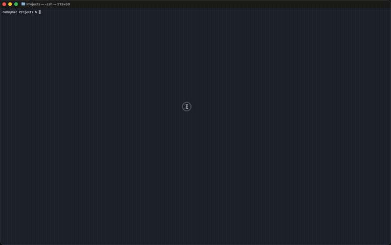
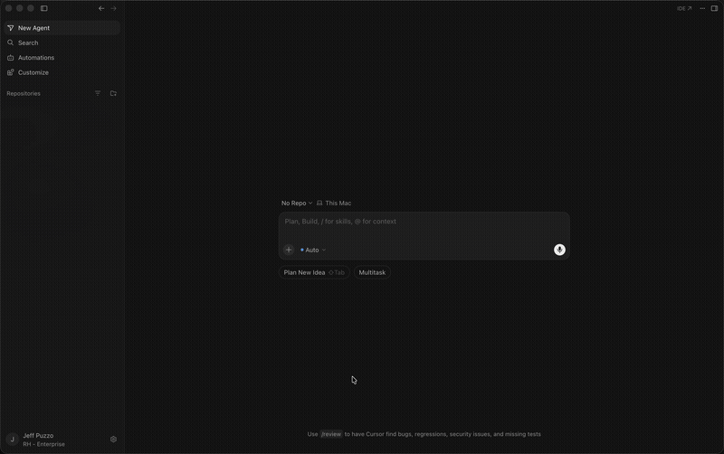

# UXD AI Helpers

[](./LICENSE)
[](./CONTRIBUTING.md)
[](./PLUGINS.md)
[](./PLUGINS.md)
[](https://github.com/rh-uxd/ai-helpers/blob/main/.skillsaw-baseline.json)

AI skills for PatternFly and UXD teams — component development, design, accessibility, and migration. Skills work in both **Claude Code** and **Cursor**; the `patternfly` meta-plugin is Claude Code-only.

<p align="center">
  
</p>

## Quick Start

### Claude Code

Add the marketplace and install the `patternfly` meta-plugin — it auto-installs all PatternFly sub-plugins in one step:

```bash
# Add the marketplace (one time)
claude plugins marketplace add rh-uxd/ai-helpers

# Install everything PatternFly (React, design guide, audit, migration, and MCP)
claude plugins install patternfly@uxd-ai-helpers
```

That's it — all PatternFly skills are now available as slash commands:

```
/pf-react:pf-test-gen          # Generate unit tests for a React component
/pf-design-guide:pf-ai-guide   # Get AI experience design guidance
/pf-design-audit:pf-color-scan # Scan for hardcoded colors that should be tokens
```

<details>
<summary>See the install flow</summary>

<br>



</details>

**Individual plugins:** Install only what you need (e.g., `claude plugins install pf-react@uxd-ai-helpers`). Don't install both `patternfly` and individual sub-plugins — `patternfly` already includes them.

Enable auto-update to receive new skills as they're merged:

`/plugin` → Marketplaces → enable auto-update

### Cursor

Cursor doesn't support the `dependencies` feature that powers the `patternfly` meta-plugin, so install plugins individually. Add the marketplace in **Settings → Marketplace**, then install the ones you need — see the [Plugins](#plugins) table below for the full list.

<details>
<summary>See it in action</summary>

<br>



</details>

After installing, skills work the same way — slash commands in any project:

```
/pf-react:pf-test-gen          # Generate unit tests for a React component
/pf-design-audit:pf-color-scan # Scan for hardcoded colors that should be tokens
```

> **Note:** Install `pf-mcp` separately for MCP server access. See the [FAQ](FAQ.md#how-do-i-test-a-skill-without-the-patternfly-mcp-server) for setup.

## Plugins

<!-- BEGIN PLUGIN TABLE -->
<table>
<tr><th>Plugin</th><th>Description</th></tr>
<tr><td nowrap><b>patternfly</b></td><td>Everything you need for PatternFly development — React components, design guidance, migration, and MCP docs</td></tr>
<tr><td nowrap><b>uxd-workshop</b></td><td>UXD team tools and skill incubator — prototyping, research, design review, team workflows</td></tr>
<tr><td nowrap><b>pf-code-review</b></td><td>Code review and quality — adversarial review, security patterns</td></tr>
<tr><td nowrap><b>pf-design-audit</b></td><td>Design audit — validate existing code and designs against PatternFly standards</td></tr>
<tr><td nowrap><b>pf-design-guide</b></td><td>Design guide — component selection, interaction patterns, AI experience patterns, Figma design creation</td></tr>
<tr><td nowrap><b>pf-migration</b></td><td>PF version migration — breaking change detection, class scanning, upgrade planning</td></tr>
<tr><td nowrap><b>pf-react</b></td><td>React component development — coding standards, testing, and structure</td></tr>
<tr><td nowrap><b>pf-workshop</b></td><td>PatternFly team tools and skill incubation — issue triage, release management, codebase auditing, new skill development</td></tr>
</table>
<!-- END PLUGIN TABLE -->

See [PLUGINS.md](PLUGINS.md) for the full list of skills, agents, and usage details.

## How It Works

1. You add this repo as a **marketplace** in Claude Code or Cursor
2. You install plugins — on Claude Code, `patternfly` auto-installs all PF sub-plugins; on Cursor, install them individually
3. Skills become available as `/<plugin>:<skill>` slash commands in any project

## Repository Structure

```
├── .claude-plugin/         # Claude Code marketplace config
├── .cursor-plugin/         # Cursor marketplace config
├── plugins/
│   ├── uxd-workshop/       # UXD team tools (skills + uxd-assist agent)
│   └── patternfly/         # PatternFly meta-plugin + sub-plugins
│       ├── agents/            # pf-assist routing agent
│       ├── pf-code-review/    # Code review and quality — security patterns
│       ├── pf-react/          # React development — testing, structure, coding standards
│       ├── pf-design-guide/   # Design guidance — component selection, AI patterns
│       ├── pf-design-audit/   # Design auditing — token checks, color scanning
│       ├── pf-migration/      # PF version migration tools
│       ├── pf-workshop/       # PF team tools and skill incubation
│       └── pf-mcp/            # MCP server integration
├── scripts/                # Automation (doc generation, scaffolding, validation)
├── CONTRIBUTING.md         # How to contribute
└── CONTRIBUTING-SKILLS.md  # Step-by-step skill creation guide
```

## PatternFly MCP Server

The [PatternFly MCP server](https://github.com/patternfly/patternfly-mcp) gives AI tools access to component documentation, prop schemas, and design guidelines. On Claude Code, `pf-mcp` is included automatically when you install `patternfly`. On Cursor, the MCP server requires [separate setup](FAQ.md#how-do-i-test-a-skill-without-the-patternfly-mcp-server).

## Contributing

See [CONTRIBUTING.md](CONTRIBUTING.md) for the contribution workflow and [CONTRIBUTING-SKILLS.md](CONTRIBUTING-SKILLS.md) for a step-by-step guide to creating skills.

## CI/CD

Every pull request runs through automated quality gates:

| Gate | What it checks |
|------|---------------|
| **Validate** | Manifest consistency, generated docs freshness, skill frontmatter integrity |
| **Secret scan** | Internal URLs and potential credentials in tracked files |
| **Link check** | Broken internal markdown links |
| **Boundary check** | PF skills don't reference UXD internals and vice versa |
| **CodeRabbit** | Automated review — structure, security patterns, best practices |

## License

[MIT](./LICENSE)
