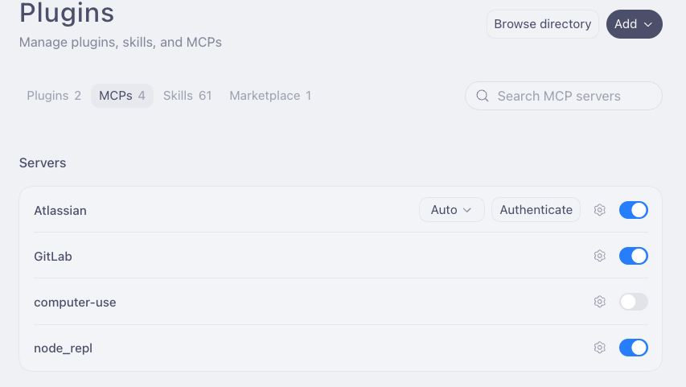
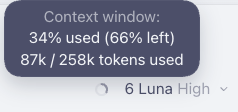
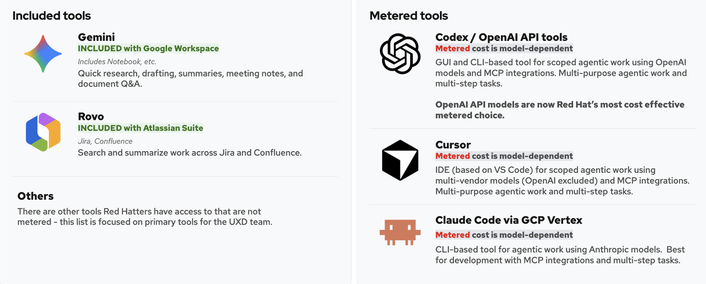

# Cost Savings & Best Practices

Use clear criteria, focused context, small iterations, and the most cost-effective
approved tool/model for the task. Optimize the **total cost of finishing the
work**, not just the price of one model call.

Start in Codex for the prototyping workflow; see [Codex setup](codex-setup.md)
for plugin access and connections. This guide accompanies the prototyping skills
created by the **UX RHAI First team**.
See the [working document](https://docs.google.com/document/d/14eVN5kyDNWaS1M8cR-p8DQ9BDQOn73fcq8PZvy_WQAo/edit?tab=t.0#heading=h.7bxejv31jp0w) for ongoing guidance.
Model availability, prices, included-tool access, and usage controls can change; check your approved catalog
and budget before a large run. Screenshots illustrate controls and example usage,
not guaranteed workflow costs or recommended default settings.

## Optimize prompts and acceptance criteria

Provide clear requirements before asking an agent to build or evaluate something.
Unclear instructions create extra clarification and rework loops, increasing cost.

The prototype evaluator works best with **specific, testable acceptance criteria**.
Ambiguous or subjective criteria can lead to unnecessary iterations and burn
through the token budget. Review the acceptance criteria in a Jira RFE or STRAT
before passing its link to the prototype evaluator.

### Avoid vague or subjective criteria

- **“The page should look good and be intuitive.”** There is no objective pass/fail
  condition; the evaluator cannot objectively verify “looks good.” Keep qualitative
  goals for human or usability review, and define the behaviors the AC check can verify.
- **“As a user I can see a click indication of ‘resolve my vulnerabilities here’.”**
  This lacks context: which page, which state, what placement, and what link target?
- **“Works as expected.”** This repeats the goal without defining what “expected” means.
- **“TBD.”** There is nothing concrete to validate. Resolve the missing criterion
  before evaluation rather than leaving the agent to skip it or infer intent.
- **Pasting Gemini meeting notes as criteria.** Full notes bloat the context window
  and mix decisions, discussion, and open questions. First turn the relevant notes
  into structured criteria; use Gemini Pro to help when it is available in your
  approved tooling, then review the result yourself.

### Use specific, testable criteria

For example:

> Given the feature flag is disabled, when the user views the status column,
> then no scheduling indicators are rendered.

Name the page/component, starting state, user action, and observable outcome.
For a link or action, include its label, placement, target, and relevant states.
Resolve contradictory requirements and open questions before starting the run.

## Iterate small

If you are concerned about AI budget, make focused, step-by-step updates rather
than repeatedly rerunning an entire workflow. Evaluate the changed scope first
and expand only when the evidence justifies it.

For the evaluator, `--max-iterations=1` caps the Phase A fix loop at one iteration;
`--no-iterate` runs one Phase A pass without looping. These are optional controls,
not prerequisites. See the [evaluator flags](../plugins/uxd-prototype/skills/uxd-prototype-evaluate/SKILL.md#flags).

## Choose the model for the task

Use the most cost-effective model that can finish the task reliably. A more
capable model, such as **GPT-6.1 Sol**, can potentially cost less overall by
finishing in fewer turns and avoiding rework.

Prefer the latest approved OpenAI models for RHAI UXD agentic work, while comparing
actual total-run cost and quality. Newer or more capable does not guarantee a
cheaper individual request; effort, context size, retries, and iterations matter.

| If the work needs… | Start with… |
|---|---|
| A quick, easy-to-check result | **GPT-6 Luna — low or medium effort** |
| Solid judgment within a clear scope | **GPT-6.1 Sol — medium effort** |
| Planning, verification, or multi-step processes | **GPT-6.1 Sol — high effort** |

These are starting points, not requirements for every workflow. Model labels and
effort controls vary by harness. If GPT-6 or GPT-6.1 models are missing from your
approved catalog, try updating Codex or restarting the harness. For setup help,
ask for help in `#forum-rhai-uxd-ai-enablement` on Slack.

### Reserve Astra for budgeted, very complex work

Avoid **GPT-6 Astra** unless the task is very complex and you have budget for its
higher pricing. Check the current approved price card before choosing it.
Pricing can also change with context size or long-context tiers; do not assume
the smallest-context rate applies to a large request.

Consult the [OpenAI API pricing page](https://openai.com/api/pricing/) and your
organization's model catalog for the applicable model/alias and current rates.

## Keep context windows focused

Scope each agent to **one goal**. Add only the context and tools needed to finish
that goal; a large context window is capacity, not a target to fill.

### Provide targeted context and tools

- Share the relevant file, frame, or document section instead of an entire project
  or transcript. File paths are often better than pasting full file contents.
- Convert meeting notes into structured criteria and a short list of decisions
  before bringing them into an agentic workflow.
- Turn off MCP servers you do not need, and verify that required servers are
  authenticated before the run starts. Tool definitions and unnecessary calls
  can add context and work.
- In Codex, check plugin/app connections before each session. An installed plugin
  can still have an expired Jira/Atlassian connection. Verify a small lookup first.
  If it fails, pause, reconnect or re-authenticate, and retry the lookup before
  continuing the full workflow.



*MCP controls: enable the services the task needs and authenticate them; disable unrelated services.*

### Keep one topic per chat

Start a new conversation when the task, audience, or goal changes. Carry forward
a concise handoff rather than dragging an unrelated conversation into the next task.

### Watch context and usage indicators

**Codex:** look for the usage indicator in the input area near the model selector.
Hover over it to see more detail about tokens used and remaining context.


*Codex usage indicator near the model selector.*



*Hovering reveals context-window details; placement and available fields can vary by version.*

Codex's context display does not establish billed spend. Check the approved team
Slack spend-tracking bot or usage dashboard before a large run and after
substantial work; follow your organization's current access and budget policy.

#### Optional: OpenCode usage display

**OpenCode CLI:** when configured, the status area can show token counts,
context-window percentage, and session cost. Check the fields your setup exposes
as the run progresses; cost displays may be estimates rather than invoices.


*Example OpenCode usage display; these numbers are not a prototype-workflow cost estimate.*

## Set scope and stopping conditions

Set a clear goal, scope, and definition of done. Use the harness's **plan mode**
(or `/plan` where supported) and review the plan before execution, especially
for broad, multi-file, multi-system, or cross-project work.

Ask the agent to stop at explicit checkpoints, such as after reviewing requirements,
after the first working change, and after validation. At each checkpoint, have it
summarize what it did, the evidence, and the proposed next action. Redirect it if
it has gone astray before it starts another costly loop.

Checkpoints are also useful places to summarize context. Ask for a compact handoff
containing the goal, completed work, remaining work, validation results, and the
path to the saved plan. The agent can draft a continuation prompt for a fresh chat
or another agent without copying the full conversation.

**Know when to stop:** redirect or stop a run early when it moves away from the
intended goal, repeats failed work without new evidence, or reaches the agreed
stopping condition.

## Watch the preview and steer live

Keep the localhost preview beside Codex while it builds. Watch page updates,
activity messages, tool results, and build logs. Interrupt or send a steering
message as soon as the work diverges from the intended design; review the first
working screen before expanding the scope.

For example:

```text
Use PatternFly components and design tokens for this screen. Check the available
PatternFly guidance before continuing, then update the preview for review.
```

A steering message can prevent a long correction loop after the build finishes.
Use visible activity and output to assess progress.

## Use included tooling where it fits

Use included AI tooling for suitable research, drafting, summarization, and
document Q&A before spending on a metered agentic workflow. “Included” means
covered by the organization's plan—not universally free or unlimited.

- **Gemini / Google Workspace:** quick research, drafting, summaries, meeting notes,
  and document Q&A; Gemini Pro can help turn notes into structured criteria.
- **Rovo / Atlassian:** search and summarize work across Jira and Confluence.
- **Agentic tools:** use approved Codex/OpenAI, Cursor, or Claude Code access when
  the task needs repository changes, tool integrations, or multi-step execution.
  Compare the total cost for the task rather than choosing a tool by habit.



*Organization-specific tooling comparison. Included services, metered access,
and model availability can change; follow the current approved access route.*

ChatGPT-linked Codex access and API-key billing are different paths. Confirm what
is included or metered for your sign-in method; see [Codex setup](codex-setup.md).
For access and budget-policy questions, consult your team's approved guidance.
