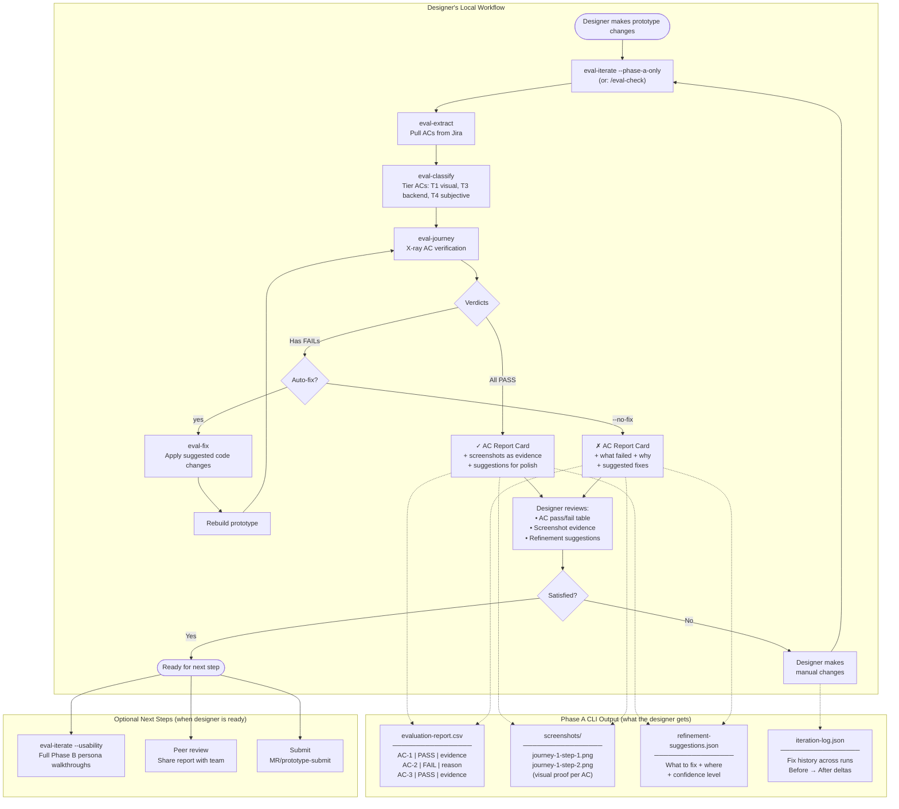
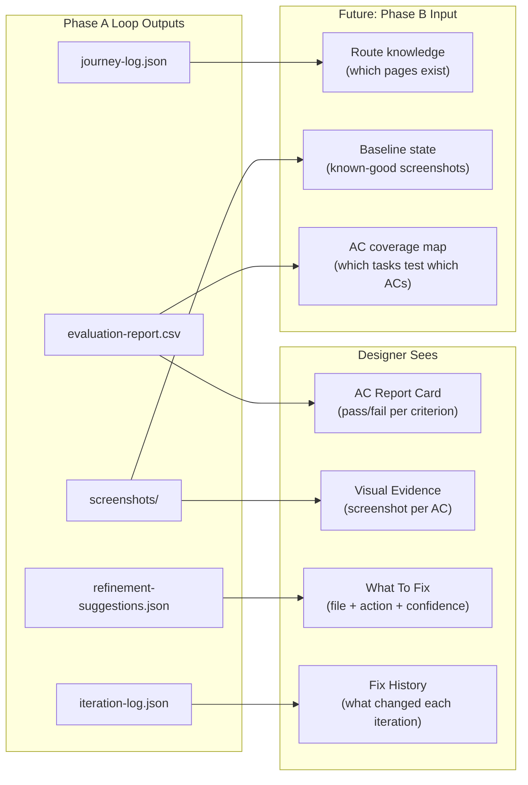

# Phase A CLI — Designer Iteration Loop

A lightweight "inner loop" mode where designers run just the x-ray AC validation cycle without discovery persona walkthroughs. Gives designers fast, actionable feedback they can verify and fix themselves before optionally sending for full usability testing.

## Workflow Diagram



## How It Feeds From the Loop



## CLI Interface (Draft)

```bash
# Quick check — just tell me what passes and what doesn't
/eval-check PROJ-299 http://localhost:9184 --workspace=/path/to/prototype

# Same thing with auto-fix loop (up to 3 attempts)
/eval-check PROJ-299 http://localhost:9184 --workspace=/path/to/prototype --fix

# Explicit: run phase A only, no usability
eval-iterate PROJ-299 http://localhost:9184 --phase-a-only --max-iterations=3

# Later, when ready for usability testing:
eval-iterate PROJ-299 http://localhost:9184 --phase-b-only
# (Reuses Phase A artifacts — doesn't re-run AC validation)
```

## What the Designer Gets (Example Output)

After running `/eval-check` on PROJ-299:

```
Eval check complete: PROJ-299 — Deploy agent images

  AC Results: 4/5 PASS, 1 FAIL, 0 FLAGGED

  ✓ AC-1  Users can deploy an agent image                    [journey-1-step-4.png]
  ✓ AC-2  Follows established model deployment patterns      [journey-1-step-3.png]
  ✗ AC-3  Users can view deployment status                   [journey-2-step-2.png]
  ✓ AC-4  Users can stop/delete a deployment                 [journey-2-step-4.png]
  ✓ AC-5  Users can configure deployment parameters          [journey-1-step-3.png]

  What failed:
  • AC-3: Status column renders but shows "Unknown" for all rows.
    Fix: src/pages/Agents/DeploymentStatus.tsx line 42 — statusMap
    missing "pending" and "running" cases.
    Confidence: high

  What to do:
  • Fix the status mapping (1 file, ~5 lines)
  • Re-run: /eval-check PROJ-299 http://localhost:9184

  ─────────────────────────────────────
  Ready for usability testing? Run:
  /uxd-prototype-evaluate PROJ-299 http://localhost:9184 --phase-b-only
```

## Key Design Principles

1. **Fast feedback** — Phase A only takes ~45-90s (no persona walkthroughs). Designer gets results while context is fresh.

2. **Self-service** — Designer can fix and re-run without needing to understand the usability framework. The output is "what failed and where to fix it."

3. **Feeds forward** — Phase A outputs become Phase B inputs when the designer is ready. No re-work. The screenshots, route knowledge, and AC map carry over.

4. **No premature usability testing** — Don't test usability on broken features. Get ACs passing first, THEN test if users can find them.

5. **Explicit opt-in for Phase B** — Usability testing is a separate decision the designer makes when they're confident the prototype is feature-complete.

## Separation of Concerns

| | Phase A CLI (eval-check) | Phase B (eval-usability) |
|---|---|---|
| **Who runs it** | Designer, self-service | Designer or CI, when ready |
| **How often** | Many times per session | Once when feature-complete |
| **Time** | 45-90s | 2-5 min additional |
| **Question** | "Did I implement the ACs?" | "Can users actually use it?" |
| **Output** | Pass/fail report card | 7-dimension usability scores |
| **Action** | Fix code → re-run | Design improvements → optional re-run |
| **Blocks on** | Nothing (first step) | Phase A passing |

## Implementation Notes

- `--phase-a-only` is essentially today's `--no-fix` + skipping Phase B
- `--phase-b-only` skips Phase A entirely, reuses existing `journey-log.json` and `extract-state.json`
- `/eval-check` is a convenience alias for `eval-iterate --phase-a-only --no-fix` with simplified output
- The "AC Report Card" output format is a simplified view of `evaluation-report.csv` rendered in the terminal
- Screenshot paths in the output are clickable (opens in preview/browser)
